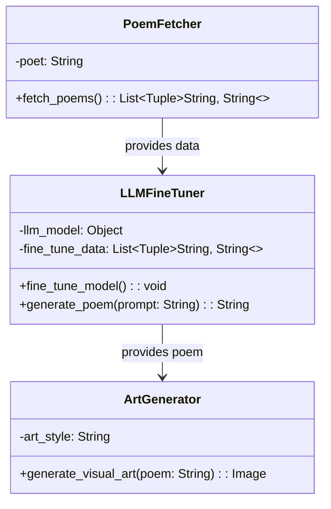

```mermaid
classDiagram
    class PoemFetcher {
        -poet: String
        +fetch_poems(): List~Tuple~String, String~~
    }

    class LLMFineTuner {
        -llm_model: Object
        -fine_tune_data: List~Tuple~String, String~~
        +fine_tune_model(): void
        +generate_poem(prompt: String): String
    }

    class ArtGenerator {
        -art_style: String
        +generate_visual_art(poem: String): Image
    }

    PoemFetcher --> LLMFineTuner : provides data
    LLMFineTuner --> ArtGenerator : provides poem
```